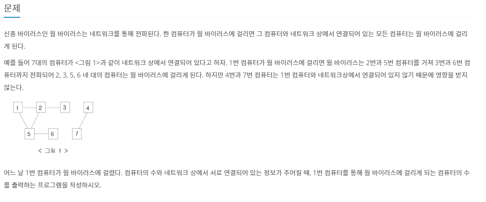

># __문제__


># __바이러스__

```cpp
#include<iostream>
#include<vector>

using namespace std;

int number, temp1,temp2, connect_number;
bool visited[101];
vector<int> computer[101];

void dfs(int x) {
	if (visited[x])
		return;
	visited[x] = true;
	for (int i = 0; i < computer[x].size(); i++) {
		int temp = computer[x][i];
		dfs(temp);
	}
}

int main() {
	cin >> number >> connect_number;
	for (int i = 0; i < connect_number; i++) {
		cin >> temp1 >> temp2;
		computer[temp1].push_back(temp2);
		computer[temp2].push_back(temp1);
	}
	dfs(1);
	int count = 0;
	for (int i = 0; i < number + 1; i++) {
		if (visited[i] == true)
			count++;
	}
	cout << count - 1 << endl; //자기 자신은 뺴고 감염시킨 숫자만 하기위해서 1을 뺴줌
}

```

> ### __해설__  

`DFS(깊이우선탐색)` 방법을 사용하여 문제를 접근한다.   

```cpp
bool visited[101] // 방문했는지 여부
vector<int> computer[101] // 그래프 
```

`visited`변수와 `computer`변수의 크기를 `101`로 정해준 이유는 0부터 시작하지 않고 1부터 시작하여 햇갈리지 않게 하기 위함이다.   

>노드 연결방법
```cpp
for (int i = 0; i < connect_number; i++) {
		cin >> temp1 >> temp2;
		computer[temp1].push_back(temp2); //각각 array에 연결된 번호 저장
		computer[temp2].push_back(temp1);
	}
```

>`DFS`함수 구현
```cpp
void dfs(int x) {
	if (visited[x]) //만약 함수가 방문한 함수일 때는 return한다.
		return;
	visited[x] = true; 
	for (int i = 0; i < computer[x].size(); i++) { //노드와 연결됨 번호로 다시 재귀적으로 함수 호출
		int temp = computer[x][i];
		dfs(temp);
	}
}
```
