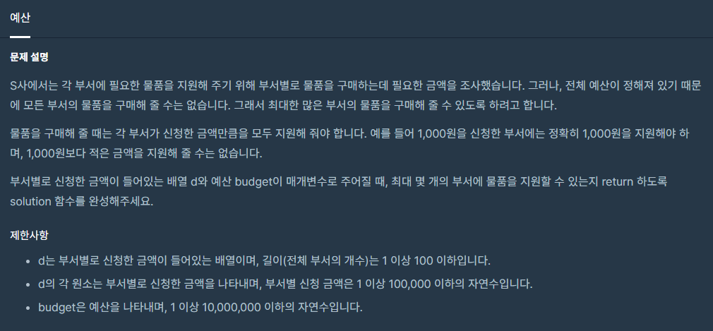

># __문제__


># __예산__

```cpp
#include <iostream>
#include <vector>
#include <algorithm>

using namespace std;

int solution(vector<int> d, int budget) {
    int max = 0;
    int sum = 0;
    sort(d.begin(), d.end());
    for(int i = 0 ; i < d.size(); i++){
        sum += d[i];
        if(sum <= budget)
            max++;
    }
    
    return max;
}
```
* * *
> ### __해설__

첫 번째로 백터들을 `Sort` 로 정렬시킨 후 하나씩 더해서 합이 `budget` 의 숫자보다 작거나 같으면 `max` 변수를 1씩 더해준다

문제의 해석이 중요한 문제이다.
>물품을 구매해 줄 때는 각 부서가 신청한 금액만큼을 모두 지원해 줘야 합니다.

라는 말이 예를들어 예산이 9원이면 9원을 <u>남김없이</u> 써야하는것 같지만 그렇지 않다.

예를들어 `{1,2,3,4,5}` 라는 부서에 예산이 `9원`이면 1원 2원 3원을 주어서 총 6원을 주어도 상관없다.

하지만 `{1,2,3,3,5}` 인 부서인 경우에는
1원 2원 3원만 줄 수 없다.

왜냐하면 1원 2원 3원에서 나머지 3원을 더 주면 총 9원 이기 떄문이다.
    


