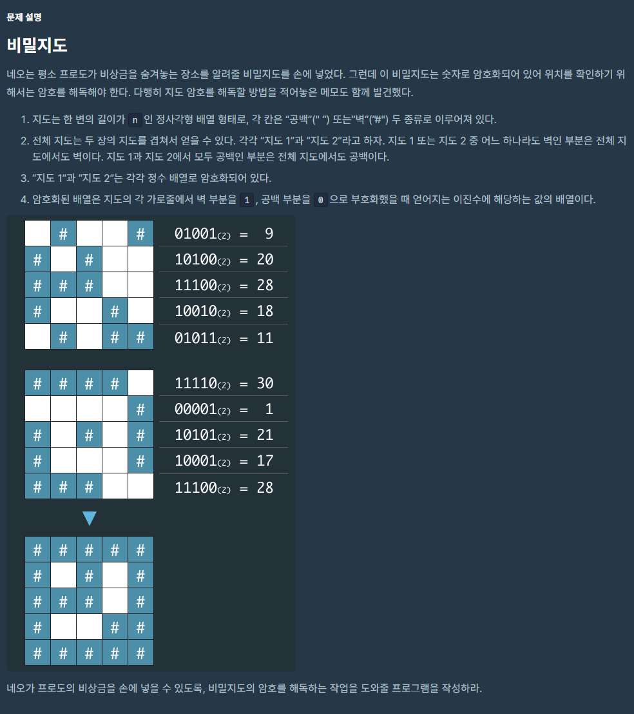

># __문제__


># __[1차] 비밀지도__

```cpp
#include <string>
#include <vector>
#include <algorithm>

using namespace std;

string convert(int a, int n) {
    string str;
    for (int i = 0; i < n; i++) {
        if (a % 2 == 0){
            str += ' ';   
        }
        else{
            str += '#';   
        }
        a /= 2;
    }
    reverse(str.begin(), str.end());
    return str;
}

string add(string str1, string str2) {
    string str;
    for (int i = 0; i < str1.size();i++)
    {
        if (str1[i] == ' ' && str2[i] == ' '){
            str += ' ';   
        }
        else {
            str += '#';
        }
    }
    return str;
}
vector<string> solution(int n, vector<int> arr1, vector<int> arr2) {
    vector<string> answer;
    for (int i = 0; i < n; i++) {
        answer.push_back(add(convert(arr1[i], n), convert(arr2[i], n)));
    }
    return answer;
}
```
* * *
> ### __해설__

### 1. `Convert` 함수
- 2진수 변환  
`arr[i]`의 값을 계속 2로 나누어서 나머지가 1일 때는 `#`을 저장 `" "`을 저장하고 `<algorithm>`헤더에 있는 `convert`로 거꾸로 출력해준다.
### 2. `Add` 함수
- `arr1`과 `arr2`를 2진수로 변환 한 값들 더해준다. 둘다 `" "`이면 `" "`을 입력해주고 둘 중 하나라도 `#`라면 `#`을 입력해준다.


