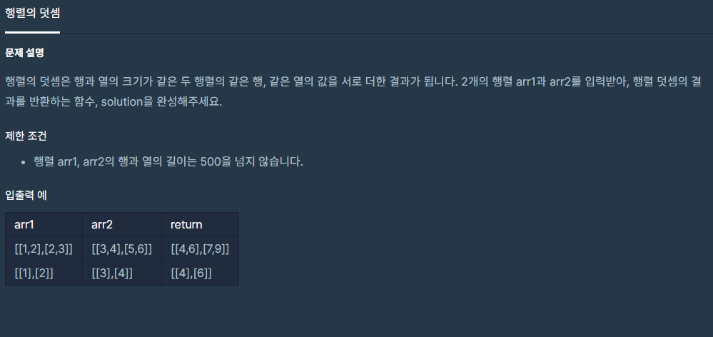

># __문제__


># __[1차] 비밀지도__

```cpp
#include <string>
#include <vector>

using namespace std;

vector<vector<int>> solution(vector<vector<int>> arr1, vector<vector<int>> arr2) {
    vector<vector<int>> answer;
    vector<int> temp;
    int sum = 0;
    for(int i = 0 ; i < arr1.size() ; i++){
        for(int j = 0 ; j < arr1[i].size();j++){
            temp.push_back(arr1[i][j] + arr2[i][j]);
        }
        answer.push_back(temp);
        temp.clear();
    }
    return answer;
}
```
* * *
> ### __해설__

### 1. `Vector` 2차원 배열 값 입력받기
따로 `temp`라는 `vector`을 만들어서 `temp`에 값을 저장한후 마지막에 2차원 배열에 `push_back`해준다.  
마지막으로 `temp`의 값은 초기화 해준다 `temp.clear()`
```cpp
 vector<vector<int>> answer;
vector<int> temp;
    int sum = 0;
    for(int i = 0 ; i < arr1.size() ; i++){
        for(int j = 0 ; j < arr1[i].size();j++){
            temp.push_back(arr1[i][j] + arr2[i][j]);
        }
        answer.push_back(temp);
        temp.clear();
    }
```


