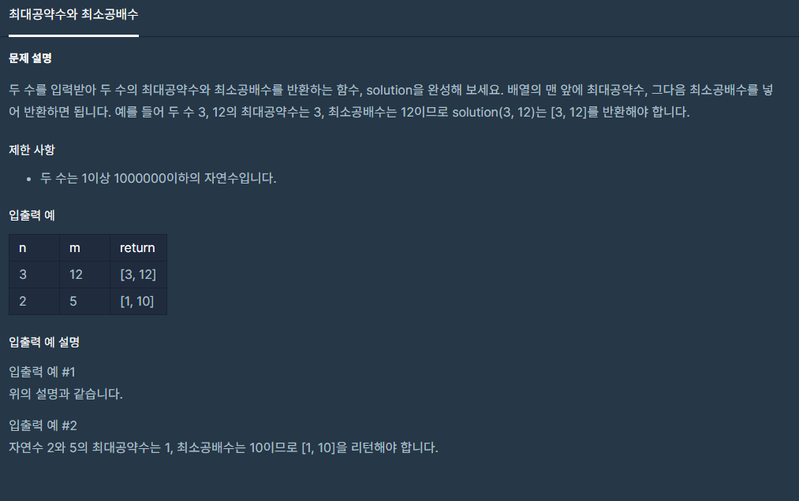

># __문제__


># __최대공약수와 최소공배수__

## __[유클리드의 호제법]__

```cpp
#include <string>
#include <vector>

using namespace std;

vector<int> solution(int n, int m) {
    vector<int> answer;
    int c;
    int a = n;
    int b = m;
    while(b){
        c = a % b;
        a = b;
        b = c;
    }
    answer.push_back(a);
    answer.push_back(n*m/a);
    return answer;
}
```
* * *
> ### __해설__  

### __`유클리드의 호제법`__
> 2개의 `자연수`(또는 정식) `a`, `b`에 대해서 `a`를 `b`로 나눈 `나머지`를 `r`이라 하면`(단, a>b)`, `a`와 `b`의 `최대공약수`는 `b`와 `r`의 `최대공약수`와 같다. 
`최대공약수`와 `최소공배수`를 구할 수 있는 알고리즘 이다.
```cpp
int a , b;
int c;

while(b){
        c = a % b;
        a = b;
        b = c;
}

return a;
```
1. 입력으로 두 수  `a,b(a>b)`가 들어온다.
2. `a`가 `0`이 아니라면, `b`를 출력하고 알고리즘을 종료한다.
3. `b`이 `a`으로 나누어 떨어지면, `a`를 출력하고 알고리즘을 종료한다.
4. 그렇지 않으면 `b`를 `a`로 나눈 나머지를 새롭게 `a`에 대입하고, `b`와 `a`를 바꾸고 `3번`으로 돌아온다.

> `최소공배수` = `a` * `b` / `최대공약수`이다.


