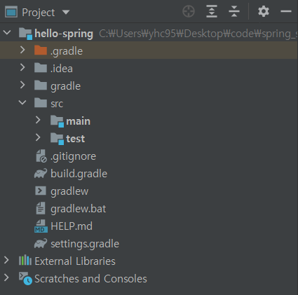
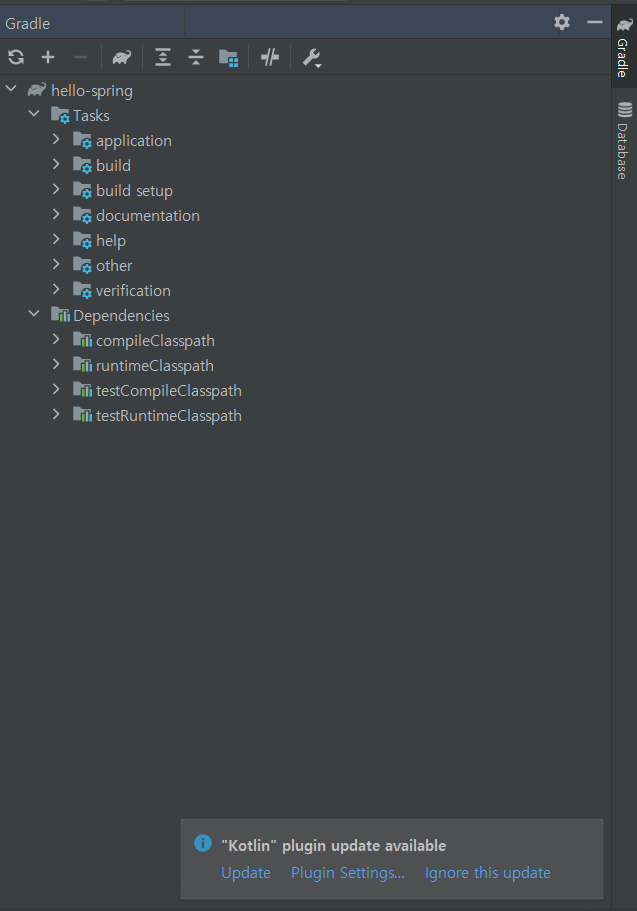

># __Hello_Spring__


### - `build.gradle`
```java
plugins {
	id 'org.springframework.boot' version '2.4.2'
	id 'io.spring.dependency-management' version '1.0.11.RELEASE'
	id 'java'
}

group = 'hello'
version = '0.0.1-SNAPSHOT'
sourceCompatibility = '11' //java version 설정
repositories {
	mavenCentral() // dependencies가 이 mavenCetral()에서 다운을 받게해줌
	//필요시 특정사이트 url을 집어넣을 수 있음
}

dependencies {
	implementation 'org.springframework.boot:spring-boot-starter-thymeleaf'
	implementation 'org.springframework.boot:spring-boot-starter-web'
	testImplementation 'org.springframework.boot:spring-boot-starter-test' // test 라이브러리 (보통 junit)
}

test {
	useJUnitPlatform()
}
```
### - `External Libraries`   
  웹라이브러리들의 모음. 클릭해서 라이브러리들을 볼 수 있음. `gradle`이 의존성이 있는 라이브러리들을 모두 떙겨옴.


- `스프링 부트 라이브러리`
  - spring-boot-starter-web
    - spring-boot-starter-tomcat : 톰캣(웹서버) 8080포트사용
    - spring-webmvc : 스프링 웹 mvc
  - spring-boot-starter-`thymeleaf`: 타임리프 템플릿 엔진(view)
  - spring-boot-starter(공통): 스프링부트 + 스프링 코어 + 로깅
    - spring-boot
      - spring-core
    - spring-boot-starter-logging (system.out.println 대신에 log 사용)
      - logback, slf4j

- `테스트 라이브러리`
  - spring-boot-starter-test
    - junit: 테스트 프레임워크
    - mockito: 목 라이브러리
    - assertj: 테스트 코드작성을 용이하게 만드는 라이브러리
    - spring-test: 스프링 통합 테스트를 지원함
  